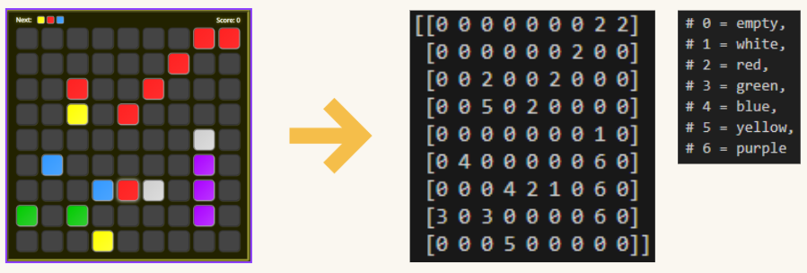
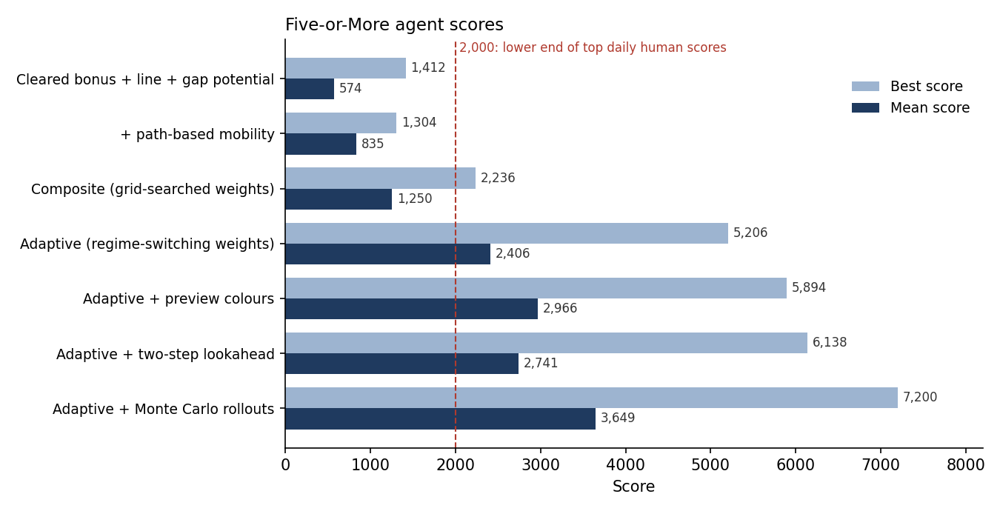
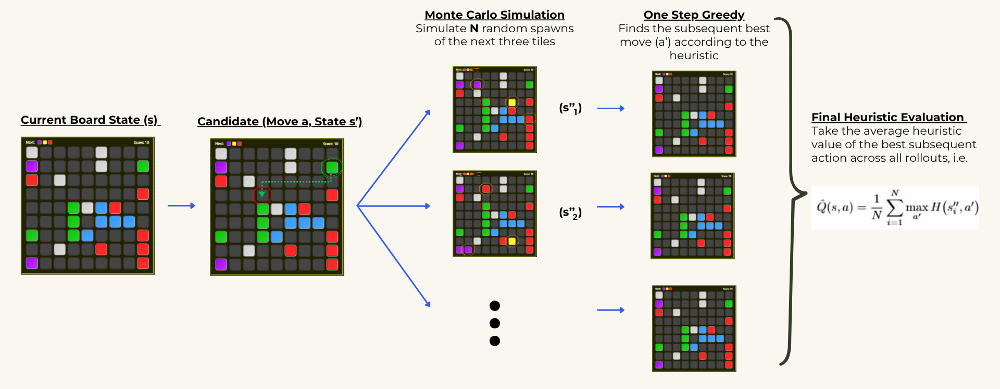

# Five-or-More AI: Decision-Making under Stochastic Uncertainty

**BSc dissertation, Durham University (2026), awarded First-Class** · [Read the paper (PDF)](paper/dissertation.pdf)

> Paper title: *Computer Playing against a Random Adversary*. Submitted under my legal name, Zheng Rong Chua.

Five-or-More is a 9×9 puzzle game. Each turn you move one tile along a clear path, aiming to form lines of five or more same-coloured tiles. If no line clears, three random tiles spawn (you see their colours in advance, but not where they will land), and the game ends when the board fills.

This project builds AI agents that maximise score in this single-agent, fully observable stochastic environment (a Markov decision process with a random "adversary"). It measures how evaluation-function design and search under uncertainty affect performance.

<p align="center"></p>

## Results



| Agent | Mean | Best | Games |
|---|---:|---:|---:|
| Cleared bonus + line + gap potential | 573.9 | 1,412 | 100 |
| + path-based mobility | 834.6 | 1,304 | 100 |
| Composite heuristic (grid-searched weights) | 1,249.7 | 2,236 | 20 |
| Adaptive heuristic (regime-switching weights) | 2,405.8 | 5,206 | 20 |
| Adaptive + preview colours | 2,966.5 | 5,894 | 20 |
| Adaptive + two-step lookahead | 2,740.6 | 6,138 | 20 |
| **Adaptive + Monte Carlo rollouts** | **3,649.2** | **7,200** | 20 |

Top daily human scores on the official platform typically fall between 2,000 and 10,000. Full results, including every ablation, are in Table 3 of the paper.

**Key findings**

- **Heuristic design matters most.** Adding gap potential to line potential raised the mean score by 316%. Clustering *lowered* it by 35%, because spatial proximity ignores the game's path constraints, so it was dropped.
- **State-dependent weights beat fixed weights.** Re-weighting features by game phase and board state lifted the mean score by 92.5% over the grid-searched composite.
- **Search amplifies the evaluator.** Monte Carlo rollouts improved the adaptive agent's mean by 51.7%, versus 37.2% for the weaker composite agent.
- **Deep RL was promising but inconclusive.** The actor–critic agent scored 6,488 in its final training episode but had not converged within 50 episodes.

## Approach

1. **Environment.** A Python re-implementation of the game, with BFS reachability for legal moves, directional line scanning, and random spawns with a three-colour preview. The board was later re-encoded as per-colour bitboards with bitwise flood-fill, which made search and simulation much faster.
2. **Heuristic evaluation functions.** Line potential, gap potential, clustering, path-based mobility, completion access, and delta variants $\Delta H = H(s') - H(s)$ that score how much a move *improves* the board. Each was tested with a greedy one-step agent through incremental ablations.
3. **Composite and adaptive evaluators.** A weighted linear combination of features, with weights chosen by grid search. The adaptive version switches weights by game phase (board fill ratio) and board-state conditions.
4. **Search under uncertainty.** Preview-colour evaluation, a two-step lookahead (ignoring spawns) with top-10 pruning, and Monte Carlo evaluation. The Monte Carlo agent scores each of the top 10 moves by sampling 10 random spawn outcomes and averaging the best follow-up value:

$$\hat{Q}(s,a) = \frac{1}{N}\sum_{i=1}^{N} \max_{a'} H\left(s''_i, a'\right)$$

<p align="center"></p>

5. **Deep reinforcement learning.** A PyTorch actor–critic network (two shared 64-unit hidden layers, then policy and value heads) over an 11-dimensional engineered feature vector. It was pretrained by behaviour cloning on games played by the adaptive agent, then trained with a policy-gradient and temporal-difference loss plus a decaying imitation term.

## Repository structure

```
paper/dissertation.pdf          Full dissertation
src/game/environment.py         Playable game (pygame, mouse controls)
src/01_heuristics/              One script per heuristic (1a–1i) and the composite agent (1j)
src/02_bitboard_agents/         Bitboard composite (2a) and adaptive (2b) agents; actor–critic RL (2c)
src/03_search_enhancements/     Preview, two-step lookahead and Monte Carlo on top of the
                                composite (3a–3c) and adaptive (3d–3f) agents
docs/                           Figures used in this README
```

## Running

```bash
pip install -r requirements.txt

# Play the game yourself
python src/game/environment.py

# Watch the composite agent, and take over at any time
# (plays one game in the terminal first, then opens the interactive window)
#   Space = pause   H = human mode   A = AI mode   N = force one AI move
python src/01_heuristics/1j_composite_heuristic.py

# Best agent: adaptive heuristic + Monte Carlo rollouts
python src/03_search_enhancements/3f_adaptive_onehalf_montecarlo.py

# Train the actor–critic agent (saves .pth checkpoints)
python src/02_bitboard_agents/2c_bitboard_deep_reinforcement.py
```

Each agent script plays one game and prints the board and final score. To reproduce the averages above, uncomment the multi-game block at the bottom of the script (100 games for single heuristics; 20 for the composite, adaptive and search agents). The search-enhanced agents are slow, and a single game can take up to an hour.
